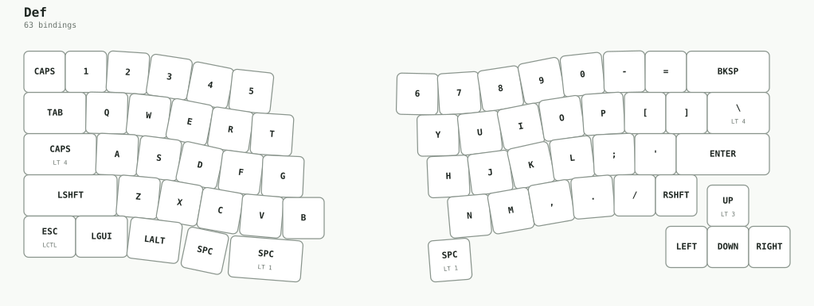
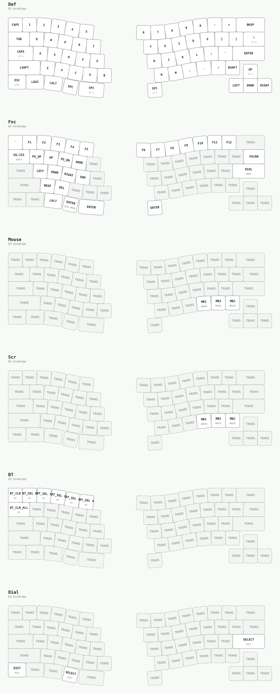
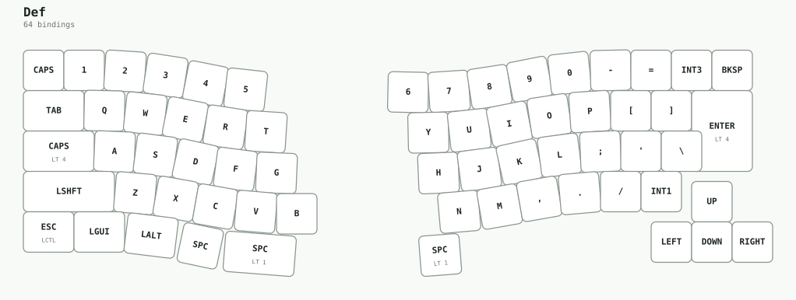
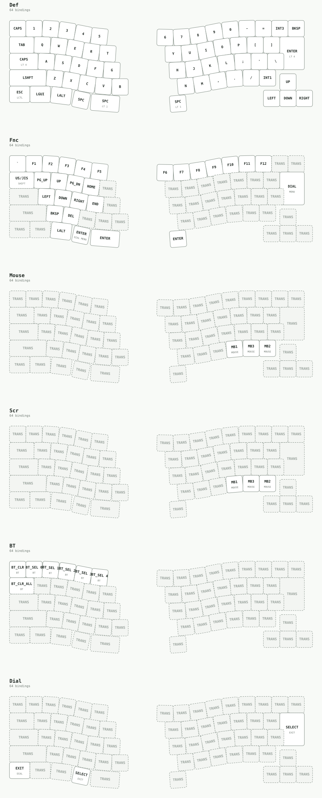

# GeaconEquinox
### ジーコン・エクイノックス

**光と影が、同じ重さになる場所。**

*Where light and shadow find their balance.*

Split keyboard · Dual optical pointing · US / JIS · ZMK

[The Pair](#the-pair--対の存在) · [Anatomy](#anatomy--ふたつの感覚) · [Interface](#interface--境界を渡る) · [Keymap](#keymap--指先の地図) · [Guide](docs/firmware.md)

---

## The Pair | 対の存在

Solsticeが、光と影の極点を司るなら。 
Equinoxは、そのふたつが釣り合う瞬間を司る。

一方は昼と夜の長さが最も離れる「至」。もう一方は、その境界が重なる「分」。 
同じ一年を巡りながら、異なる節目を刻むふたつの名。

GeaconEquinoxは、[GeaconSolstice](https://github.com/te9no/zmk-config-GeaconSolstice)と対をなす分割キーボード。 
その系譜を受け継ぎながら、左右に異なる光学の感覚を宿す。 
同じ形に揃えるのではなく、違うものが、ひとつの操作に落ち着くこと。 
この装置における均衡は、対称ではなく、調和である。

## Classification | 分類

| | |
| :-- | :-- |
| **Name / 名称** | GeaconEquinox — ジーコン・エクイノックス |
| **Archetype / 象徴** | 昼夜の均衡・二相の調和 |
| **Counterpart / 対の存在** | GeaconSolstice |
| **Form / 形態** | 左右分割・デュアルポインティング |
| **Nature / 性質** | 異なる感覚を、ひとつの意図へ |

## Emblem | 太陽と月の紋章

ひとつの顔に、太陽と月。 
外へ広がる光と、内へ抱く影が、中央の線で出会う。

紋章から伸びる回路は、その均衡を指先へ運ぶ道。 
星は方位を示し、ふたつの相は同じ笑みを共有する。 
離れていても、対立してはいない。

## Anatomy | ふたつの感覚

**Left — 光を読む。** 
PAT9125ELによる光学ダイヤル。通常はスクロール、レイヤー1ではダイヤルコントローラとして働き、
Centralとして両手の信号をPCへ届ける。

**Right — 軌道を描く。** 
PMW3610のトラックボール。指先が描く軌跡を受け取り、
Peripheralとして左手とBLEでつながる。

左右で異なるセンサーを用いながら、操作する先はひとつ。 
手を置く場所を大きく変えずに、文字と座標のあいだを行き来するための構成。

## Interface | 境界を渡る

**ふたつの配列。** 
右手はUS/JISの物理配列に対応。組み立てた配列に合わせて、
左右一組のファームウェアを選ぶ。

**受け継がれる操作。** 
Solsticeを参照した、通常・Fn・Mouse・Scroll・Bluetoothの5レイヤーに、専用のDialレイヤーを加えた構成。
Spaceを長押しすればFnへ。ポインティングはスクロールへ姿を変える。

**もうひとつの読み方。** 
Fn＋TabでLayout Shiftを切り替える。US/JISどちらの構成にも備え、
切り替えた状態は再起動後も引き継ぐ。

[USキーマップ](config/GeaconEquinox_US.keymap) · [JISキーマップ](config/GeaconEquinox_JIS.keymap)

## Keymap | 指先の地図

ふたつの配列、ひとつの操作感。実際のキー位置とキーマップから生成した図です。
キー中央はタップ、下段は長押し。`LT n`は長押しでレイヤーn、`TRANS`は下のレイヤーに委ねるキーです。
図はリポジトリの初期設定を示し、Studioで変更した内容は含みません。

### US

USの全6レイヤーを見る

### JIS

JISの全6レイヤーを見る

`DIAL / MENU`はダイヤルメニュー、`SELECT / EXIT`はタップで選択・長押しで終了。
`US/JIS / SHIFT`はLayout Shiftの切り替えを表します。
図の[生成・更新方法](docs/keymap-diagrams.md)。

## Field Guide | 手に取るために

[ファームウェアと導入・ビルド](docs/firmware.md) · [配線とハードウェア](docs/hardware.md)

ファームウェアは左右×US/JISの4構成。日次ビルドチェックと、
ソース更新時に生成物を同じブランチへ保存するワークフローを備える。

> **実機検証は未完了です。** ビルド確認と実機確認は区別しています。
> 導入前に[検証状況](docs/firmware.md#検証状況)をご確認ください。Solstice用ファームウェアとは互換ではありません。

## Lineage | 系譜

[GeaconSolstice](https://github.com/te9no/zmk-config-GeaconSolstice) — 対となる存在、配列と操作の系譜。 
[MeKaBu / TBENC](https://github.com/te9no/zmk-config-MKB2/tree/TBENC) — 左手の光学入力の実装参照。

## Acknowledgements | この回路に流れるもの

この装置は、ひとりの手だけでは生まれなかった。 
光を読むコード、配列を翻訳する仕組み、離れた両手を結ぶ基盤。 
そのひとつひとつを作り、公開し、育ててきた方々に感謝します。

### 指先に届く仕組み

- **[cormoran](https://github.com/cormoran)** — [LED Animation](https://github.com/cormoran/zmk-driver-animation)と[Ext Power Transient](https://github.com/cormoran/zmk-driver-ext-power-transient)。光で状態を伝え、必要なときに電源を届ける仕組みに。LED構成は[SparAkashaAnanta](https://github.com/te9no/zmk-config-SparAkashaAnanta)を参照しています。
- **[caksoylar](https://github.com/caksoylar)** — [RGB LED Widget](https://github.com/caksoylar/zmk-rgbled-widget)。XIAO内蔵の小さな光に、電池・接続・レイヤーの状態を託す仕組みに。
- **[cormoran](https://github.com/cormoran)** — 採用している[ZMKフォーク](https://github.com/cormoran/zmk)と、[Custom Studio RPC対応PMW3610ドライバ](https://github.com/cormoran/zmk-driver-pmw3610-with-custom-studio-rpc)。光学入力と、その内部を観測する仕組みを提供してくださったことに。
- **[kot149](https://github.com/kot149)** — [Layout Shift](https://github.com/kot149/zmk-layout-shift)。OS配列とキーコードの違いを橋渡しし、使い慣れた操作を保つ仕組みに。
- **[sekigon-gonnoc](https://github.com/sekigon-gonnoc)** — [CDC ACM Bootloader Triggerの原流](https://github.com/sekigon-gonnoc/zmk-feature-cdc-acm-bootloader-trigger)。USBシリアルから書き込みモードへ移る仕組みに。Equinoxでは[cormoran版](https://github.com/cormoran/zmk-feature-cdc-acm-bootloader-trigger)を経た[te9no版](https://github.com/te9no/zmk-feature-cdc-acm-bootloader-trigger)を使用しています。

### 光学入力の系譜

採用したPMW3610モジュールの先にも、受け継がれてきた仕事があります。

- **[badjeff](https://github.com/badjeff)** — [PMW3610ドライバ](https://github.com/badjeff/zmk-pmw3610-driver)。[cormoranの従来ドライバ](https://github.com/cormoran/zmk-pmw3610-driver)のフォーク元として、現在の実装を支える基礎に。
- **[ufan](https://github.com/ufan)** — [ZMK PixArtセンサードライバ](https://github.com/ufan/zmk/tree/support-trackpad)。PMW3610ドライバのREADMEで先行実装として挙げられている仕事に。
- **[inorichi](https://github.com/inorichi)** — [PMW3610ドライバ](https://github.com/inorichi/zmk-pmw3610-driver)。同じく、その実装の土台となった仕事に。
- **[sekigon-gonnoc](https://github.com/sekigon-gonnoc)** — [高分解能ダイヤルドライバ](https://github.com/sekigon-gonnoc/zmk-driver-hires-dial)。PAT9125ELによるスクロールとRadial Controllerの実装に。
- **[taichan1113](https://github.com/taichan1113)** — TBENCと同じ系譜の[PAT9125ドライバ](https://github.com/taichan1113/zmk-driver-pat9125)。初期立ち上げで使用した光学入力の実装に。
- **Zephyrの入力ドライバ開発者の皆さん** — PMW3610実装の参考となった[Zephyrドライバ](https://github.com/zephyrproject-rtos/zephyr/blob/main/drivers/input/input_pmw3610.c)、そして採用PAT9125ドライバの基礎となる[PAT912xドライバ](https://github.com/zephyrproject-rtos/zephyr/blob/main/drivers/input/input_pat912x.c)に。PAT912xソースにはGoogle LLCの著作権表記があります。

### 両手を支える基盤

- **[ZMKのコントリビューターの皆さん](https://github.com/zmkfirmware/zmk)** — キー入力、レイヤー、分割接続、Studioを支えるファームウェアに。
- **[Zephyr Projectの皆さん](https://github.com/zephyrproject-rtos/zephyr)** — 無線・USB・デバイスドライバと、それらが動く土台に。採用ZMKを通して[ZMK向けZephyrフォーク](https://github.com/zmkfirmware/zephyr)を利用しています。

このリポジトリでは、さらにte9noの[3-wire SPIモジュール](https://github.com/te9no/zmk-driver-spi-three-wire)と[共通ビルド基盤](https://github.com/te9no/zmk-workspace)を組み合わせています。

ここで紹介したのは、直接採用したモジュールと、README・フォーク情報から確認できた主な系譜です。 
名前を挙げきれない依存ライブラリ、修正、レビュー、文書化にも敬意を込めて。各プロジェクトのライセンスと著作権表記は、それぞれのリポジトリを参照してください。

---

*Solstice marks the extremes. Equinox holds the balance.*

**極点に、Solstice。均衡に、Equinox。**

